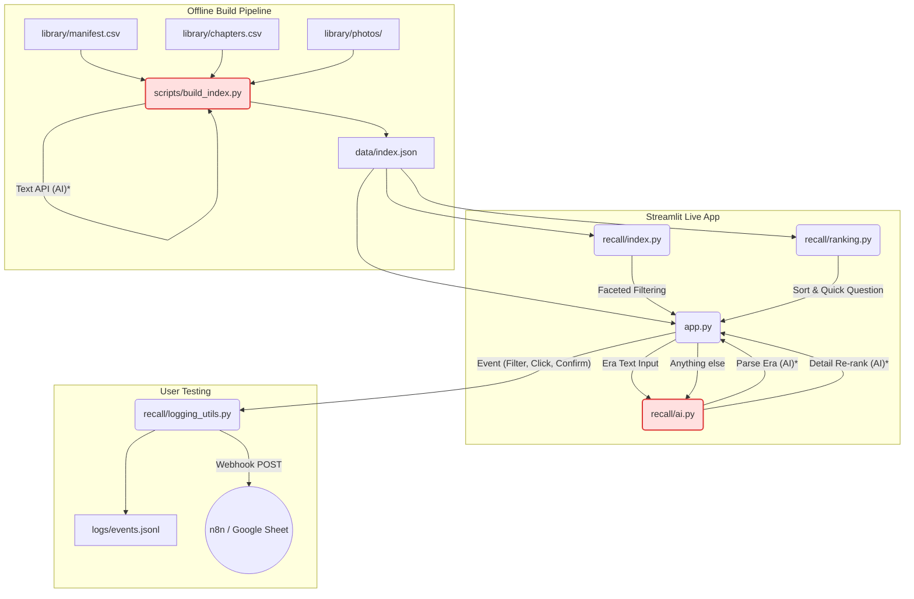

# Architecture & Data Flow

## 1. Data Flow Diagram

*\* Note: AI parts are implemented or planned for Milestone M4. `build_index.py` currently runs in `--no-ai` mode with heuristic fallbacks.*

---

## 2. Fields in `index.json`

*   `photos` (dict by filename):
    *   `id`: `str`
    *   `taken_at`: `str` (ISO format)
    *   `lat`, `lon`: `float` or null
    *   `place`, `city`: `str` or null
    *   `people`: `list[str]`
    *   *AI Labels (M4)*: `caption`, `scene`, `activity`, `objects`, `clothing_colours`, `text_in_image`, `mood`
*   `events` (list):
    *   `id`: `str`
    *   `start`, `end`: `str` (ISO format)
    *   `photo_ids`: `list[str]`
    *   `place`: `str`
    *   `people`: `list[str]`
    *   `event_label`: `str` (AI generated or heuristic)
    *   `event_type`: `str` (e.g. food, celebration, document, screenshot)
*   `chapters` (list):
    *   `name`: `str`
    *   `start`, `end`: `str` (ISO format)
    *   `aliases`: `str`
*   `people` (list):
    *   Global list of `str` names/face-groups for quick lookup.

---

## 3. Modules

*   `app.py`: Entry point for the Streamlit app. Renders the sidebar, filters, counters, candidate moments, and the "This is the photo" confirmation flow.
*   `pages/1_How_it_works.py`: Explanation of the tool for test participants/evaluators (M5).
*   `pages/2_Test_results.py`: Analytics dashboard reading from local JSONL logs to compute task success %, steps, and durations.
*   `recall/index.py`: Core logic for applying the 5 facets and computing the available options + counts for the remaining facets.
*   `recall/ranking.py`: Sorts candidate moments by size/recency and generates the dynamic rule-based narrowing question when candidates > 5.
*   `recall/ui.py`: UI helper components, custom CSS, Base64 image loaders, and the moment card render function.
*   `recall/logging_utils.py`: Telemetry functions (`start_task`, `log_event`) for local appending and optional webhook POSTing.
*   `recall/ai.py`: Gemini client wrappers for text/vision queries, era parsing, and semantic re-ranking (M4).
*   `scripts/build_index.py`: Offline pipeline to merge manifest CSVs with EXIF, geocode lat/lons, chunk photos into events (or isolated screenshots), and build the `data/index.json`.

---

## 4. Facet Filtering & Count Logic

**How facets narrow each other:**
The application uses true faceted search logic. The filters applied by the user are:
1.  **Who** (People)
2.  **Where** (Place/City)
3.  **When** (Chapters / Year ranges)
4.  **What happened** (Event Labels)
5.  **Type** (Photos vs Screenshots/Documents)

When a user selects an option in *Facet A*, the available candidates (photos/events) are reduced. 

**How counts are computed:**
For every facet (e.g. *Facet B*), the system calculates what the available options and counts would be **if the user applied all current filters EXCEPT the filter for *Facet B***. 
This ensures that the user can always see exactly how many moments/photos would be returned if they click a chip in that facet, without the facet artificially narrowing itself to 0. 

**"Not sure / Any" logic:**
A "Not sure / Any" option is appended manually in the UI to the list of choices for every facet. In the filtering backend, selecting this value is explicitly ignored so that it doesn't arbitrarily constrain the result set, allowing users a psychological "out" if their memory is fuzzy, keeping them in the flow without dead-ending.
